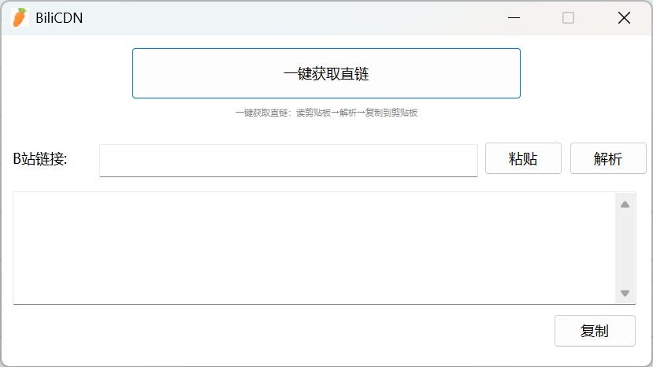

# BiliCDN

解析B站视频链接，获取直链CDN下载地址。原生Windows GUI工具，大小仅约8KB，无需运行时、无依赖，Windows 10/11 通用。

> **免责声明：** 本程序仅供学习交流，请勿用于非法用途。

## 功能

| 按钮 | 功能 |
|------|------|
| `粘贴` | 将剪贴板中的B站链接粘贴到输入框 |
| `解析` | 解析输入框中的B站链接，输出CDN直链 |
| `复制` | 将结果区的CDN直链复制到剪贴板 |
| `一键解析` | 读取剪贴板B站链接 → 解析 → 复制CDN到剪贴板 |

## 截图



## 使用方法

1. 在浏览器中复制B站视频链接（如 `https://www.bilibili.com/video/BV1xx411c7mD`）
2. 打开 `bilicdn.exe`
3. 点击 **粘贴** 输入链接，点击 **解析** 查看直链，或直接点 **一键解析** 一步到位
4. CDN 链接可在播放器或下载工具中直接使用

## 下载

从 [GitHub Releases](../../releases) 下载最新版 `bilicdn.exe`。

## 从源码编译

**环境要求：** Visual Studio 2022 (Build Tools) + Windows 10 SDK

```bat
cd src
build.bat
```

输出：`bilicdn.exe`（UPX压缩后约8KB）

### 编译说明

- MSVC `/O1 /GS- /NODEFAULTLIB` — 无C运行时，自写入口点
- WinHTTP 实现 HTTPS API 调用，TLS 1.2
- 纯字符串扫描解析JSON，无第三方库
- Unicode 对话框（WCHAR），正确处理中文显示
- Common Controls v6 Manifest，启用Windows现代控件风格
- UPX `--best` LZMA 压缩

## License

MIT
